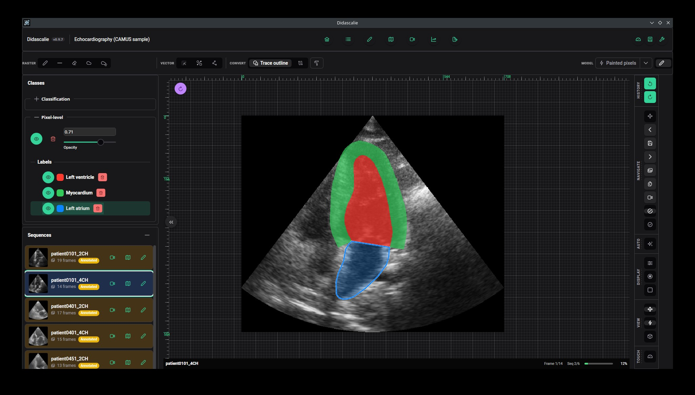
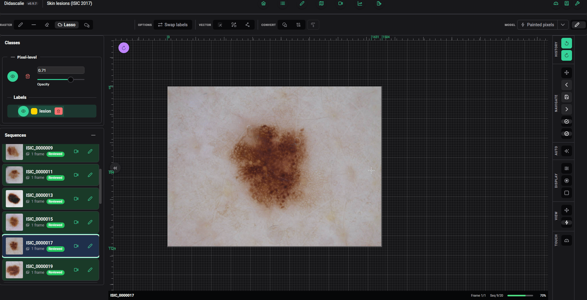
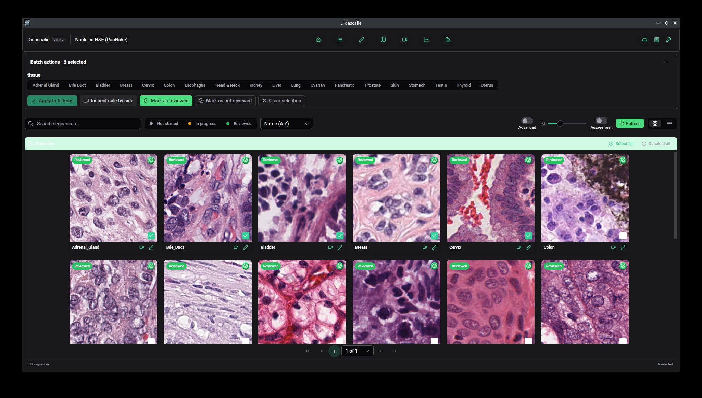
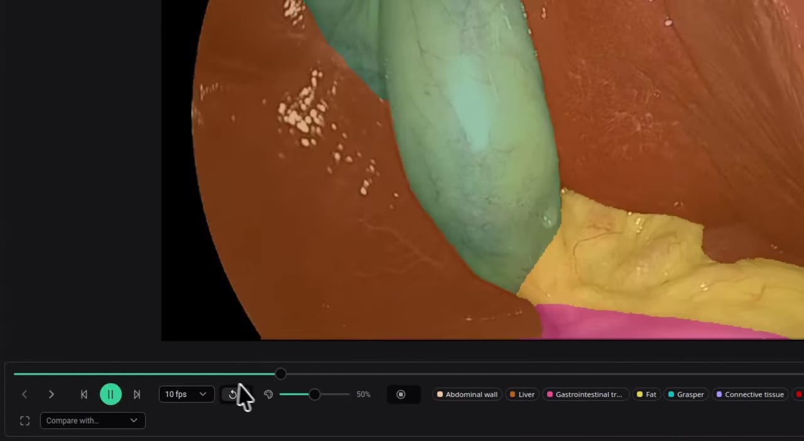
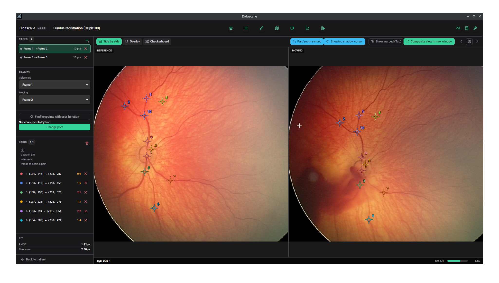
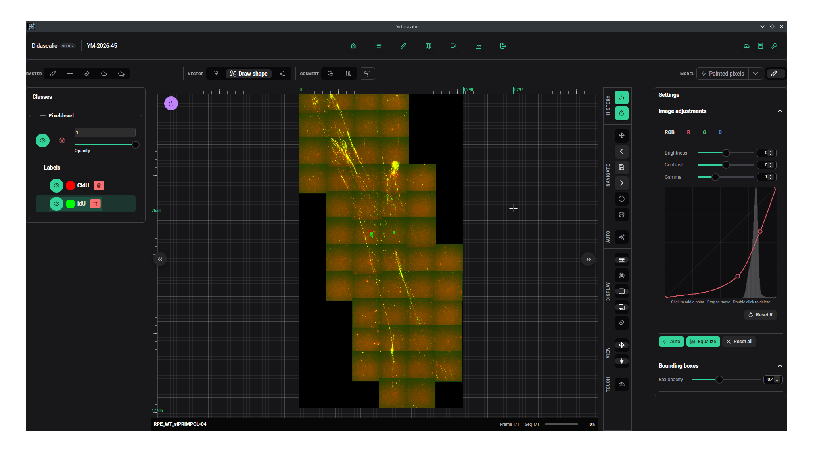
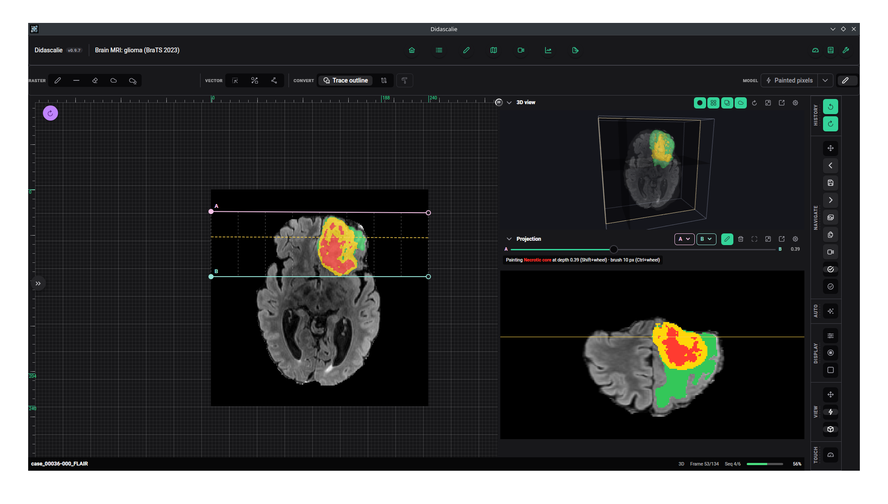

<h1 align="center">Didascalie</h1>

<p align="center">
  A desktop tool for annotating medical images, running entirely on your own machine.
</p>

<p align="center">
  
  
  
  <a href="https://didascalie.readthedocs.io/"></a>
</p>

<p align="center">
  <b><a href="https://didascalie.readthedocs.io/">Documentation</a></b>
  ·
  <a href="https://didascalie.readthedocs.io/install/">Installing</a>
  ·
  <a href="https://didascalie.readthedocs.io/quickstart/">Quickstart</a>
  ·
  <a href="https://github.com/ClementPla/Didascalie/releases">Releases</a>
</p>

---

<p align="center">
  
</p>

Didascalie annotates medical images with segmentation masks, vector shapes, classification labels and keypoints. Drawing, image processing and model training all run on your computer. Nothing is uploaded.

It started as a personal project, out of frustration with the tools I knew. Many researchers and clinicians still annotate images in Paint or PowerPoint, and the tools built for the task often assume skills they don't have: asking a clinician to `pip install` a package and run a script is less trivial than it sounds. Didascalie is an installer and a project file.

The core annotation workflow is usable day to day and has been used in published research. The project is under active development, and the features marked *experimental* are less reliable.

A *didascalie* (*di-da-ska-LEE*) is the French word for a stage direction, one of the notes in a play script. Annotations are notes added to data.

## What it does

- **Segmentation masks**, painted with pen, line and lasso tools, one mask per label. Instance segmentation is supported.
- **Vector shapes** on the same image, with one undo history for both. A mask can be traced into an editable outline or centreline, and a shape painted back into the mask.
- **Classification and text notes** per frame, with several tasks per project and batch classification from the gallery.
- **Assisted labelling**, from instant operators to a model trained on your own scribbles (see below).
- **Very large images.** Gigapixel microscopy is annotated at full resolution, from a resolution pyramid and tiles loaded on demand.
- **Sequences.** Group images into videos, volumes or patient visits, copy labels from one frame to the others, and play a sequence back with its labels in the inspector.
- **Frame registration.** Place corresponding keypoints on two frames and check the estimated transform with overlay and checkerboard views.
- **A gallery to track progress**, with filters by name, review status and keypoints.
- **Several annotators in one project.** Each has an account and annotates the same images independently; roles separate administrators from editors, and an inter-grader page reports Dice, IoU and kappa between graders, with pictures of where they differ.
- **One file per project.** A `.dida` file is a SQLite database holding the images (embedded or referenced), annotations, labels and trained model.

<table>
  <tr>
    <td width="50%"><br><sub>Assisted labelling: a rough stroke refined by an operator.</sub></td>
    <td width="50%"><br><sub>The gallery: filter sequences and track review status.</sub></td>
  </tr>
  <tr>
    <td><a href="https://didascalie.readthedocs.io/guide/inspect/"></a><br><sub>The inspector: play a sequence back with its labels (<a href="https://didascalie.readthedocs.io/guide/inspect/">video</a>).</sub></td>
    <td><br><sub>Frame registration from keypoint correspondences.</sub></td>
  </tr>
  <tr>
    <td><br><sub>A very large image, annotated at full resolution.</sub></td>
    <td><br><sub>3D volume mode (experimental): a sequence as a volume.</sub></td>
  </tr>
</table>

## Assisted labelling

**Nothing to set up.** Paint roughly over a region and an operator refines the stroke: dynamic Otsu thresholding or flood fill, with optional smoothing and a connectivity constraint. Brightness, contrast, gamma and tone curves can be fed to the operators, so they read the same enhanced image you are looking at.

**A model trained on your data.** Scribble on a few frames and Didascalie fits a small segmentation head, then applies it to the rest. The features come from a frozen self-supervised encoder (DINOv3 by default) and are computed once per image, so training takes seconds to minutes on a laptop. The model is saved in the project file. The encoder is downloaded once; no data is sent anywhere.

## Why you might use it

There are several good open-source annotation tools already. Reasons this one might suit you:

- **Your images can't leave the machine.** There is no server. Model training and inference run where the annotation happens.
- **Large medical images stay responsive.** Decoding, mask encoding and file I/O run in a compiled Rust backend.
- **Masks and vector shapes in one tool**, convertible in both directions.
- **A project is one file.** Sending an annotation task to a collaborator, or getting it back, means sending that file.
- **Native installers** for Windows, macOS (Intel and Apple Silicon) and Linux.
- **It has been used for real work.** Annotations made with it have gone into published research (the [DNAi study](https://academic.oup.com/nar/article/54/7/gkag335/8657744?searchresult=1)).
- **It was built with the people who annotate.** Clinicians and researchers from several medical fields have used it on real data throughout development.
- **It is easy to influence.** A young solo project with no fixed roadmap. See [Contributing](#contributing).

## Experimental features

These are hidden until you switch on **Experimental features** in the toolbar. They work, but they are unfinished and lightly tested.

- **3D volume mode.** A sequence opened as a volume, with a 3D view and a curved projection you can paint on.
- **Superpixel selection** and **MedSAM refinement**, two more ways to refine a stroke.
- **Python bridge.** Python functions of yours propose keypoint pairs for registration, or segment a frame or a whole sequence from the editor, over ZeroMQ.

Details are in the [documentation](https://didascalie.readthedocs.io/experimental/).

## Try it

[`examples/`](examples/) contains a small sample project, `nuclei_histology.dida`, and a script that builds eight more from public datasets: fundus photographs (including a set traced by two graders, to try the inter-grader page), dermoscopy, laparoscopy and ultrasound videos, brain MRI and liver CT volumes, and a registration set. Their sources and licences are listed in the [examples README](examples/README.md).

## The `.dida` format and the Python library

A `.dida` file is an ordinary SQLite database. The companion library, [**pydidascalie**](https://github.com/ClementPla/pydidascalie), reads and writes it without the application running. Typical uses:

- **Start from a model's predictions.** Write them into a project, so annotators correct a draft.
- **Bulk import** of a folder of images, with existing masks if you have them.
- **Read the results** for training or analysis.
- **Convert** to and from COCO and YOLO.

It is not on PyPI. Install it from the repository:

```bash
pip install git+https://github.com/ClementPla/pydidascalie.git
```

```python
from didascalie import DidascalieProject, Label

with DidascalieProject.create("dataset.dida", name="My Dataset") as project:
    project.add_label(Label(name="lesion", color="#FF0000"))
    project.import_folder("/path/to/images")
```

It requires `numpy` and `Pillow`, plus `pyzmq` and `msgpack` for the Python bridge.

## Installing

Download the installer for your platform from the [Releases page](https://github.com/ClementPla/Didascalie/releases). The application updates itself afterwards.

Training works on the CPU. Using an NVIDIA GPU needs the CUDA Toolkit: see [Installing](https://didascalie.readthedocs.io/install/).

### Building from source

**Requirements:** [Node.js and npm](https://nodejs.org/), [Rust](https://www.rust-lang.org/tools/install), and the [Angular CLI](https://angular.dev/tools/cli).

```bash
git clone https://github.com/ClementPla/Didascalie.git
cd Didascalie
npm install
npm run tauri dev      # run in development
npm run tauri build    # build installers into src-tauri/target/release/
```

Building with GPU support needs the CUDA Toolkit; `cargo build --no-default-features` skips it.

Didascalie is built with Tauri v2 and Rust, Angular 20 and PrimeNG, SQLite, WebGPU, ONNX Runtime, burn, three.js and ZeroMQ.

## AI-assisted development

For a couple of years I built this alone. As more people started using it, the features, tests, debugging and documentation they asked for started to feel like a full-time job for one person, so I now use an AI coding tool (Claude Code) to help implement them. I find it often codes more efficiently than I do, as long as it is closely supervised, and I review what it produces.

I think this only holds for a single developer who knows the whole codebase. It is why contributions need a human intent behind them, as described below.

## Contributing

This is a one-person project, and bug reports and suggestions are welcome: please open an issue. If you work with medical images and something is missing or awkward, I would like to hear about it.

Pull requests are welcome too, provided they come with a clear, documented rationale written by a person.

## License

BSD 3-Clause. See [`LICENSE`](LICENSE).
