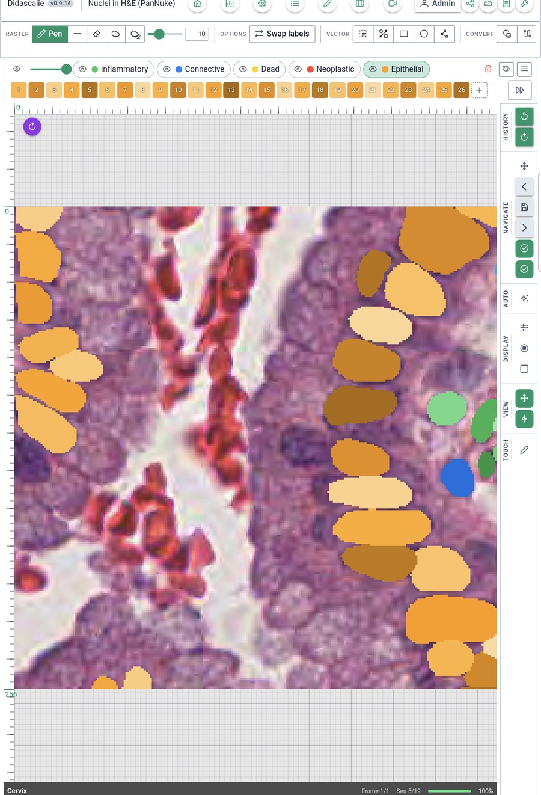

# Android tablets

Didascalie runs on Android tablets, with finger and pen input. This is recent:
it works, but there is no prebuilt APK yet, so you build it yourself. It has
been tested on one device, a Samsung Galaxy Tab S9 FE with Android 16.

{ width="420" }

## What works

- Opening a `.dida` file from the tablet's storage, or with **Open with** from a
  file manager or a mail attachment.
- The gallery and the editor, with the raster and vector tools.
- Registration and the 3D projection view take touch input, but have been
  tried less than the editor.
- Touch: one finger draws, two fingers pan and pinch, a long press opens the
  label picker.
- Portrait and landscape. In portrait the labels move to a bar above the
  canvas.

## What is missing

| Not on Android | Why |
| --- | --- |
| Trained model, MedSAM | The training and inference stack is not built for Android. |
| Projects made from video files | Frames are decoded by `ffmpeg`, which Android does not have. |
| [Python functions](guide/python-functions.md) | ZeroMQ is left out of the build. |
| Creating a project, importing, exporting to COCO or YOLO | They rely on desktop folder dialogs. Prepare the project on a computer. |
| Detached windows, automatic updates | Desktop only. |

## Projects on the tablet

Android hands an application a picked file as a stream, not as a path a database
can open. Didascalie therefore copies the project into its own storage and works
on that copy:

- Opening a large project takes the time of the copy, and the tablet holds the
  file twice. The original can be deleted afterwards.
- Annotations are not written back to the file you opened. To get them out, use
  **Save a copy** (the share icon in the top bar), which writes the project with
  its annotations wherever you choose.
- Projects already opened stay under **Recent**, and survive an update of the
  application. Uninstalling it deletes them.

!!! tip "The file does not show in the picker"
    Samsung's file picker has filter chips (Image, Video, Document…). With one
    selected, `.dida` files are hidden. Tap the highlighted chip to clear it.

## Tablet controls

- **Frames.** On a sequence, the strip under the canvas has previous and next
  buttons and a slider.
- **Touch & pen** options, opened from the **Touch** button of the tool rail:
    - pressure sensitivity: pressing harder draws a wider stroke;
    - draw with the pen only: a finger then pans the image;
    - pen side button: a stroke with the button held erases, pans or opens the
      label picker. Hold the button before the pen touches the screen.

## Building the APK

You need what a desktop build needs (see [Installing](install.md#building-from-source)),
plus Android Studio with the SDK and NDK, a JDK 17, and the Android Rust target:

```bash
rustup target add aarch64-linux-android
npx tauri android build --apk --target aarch64
```

`ANDROID_HOME`, `NDK_HOME` and `JAVA_HOME` must be set. The result is an
unsigned APK under
`src-tauri/gen/android/app/build/outputs/apk/universal/release/`.

Android only installs signed APKs. Sign it with a key of your own and install it
over USB:

```bash
zipalign -p 4 app-universal-release-unsigned.apk didascalie.apk
apksigner sign --ks my-key.jks didascalie.apk
adb install -r didascalie.apk
```

Keep the key: an update must be signed with the same one, or Android refuses it
until the application is uninstalled.
