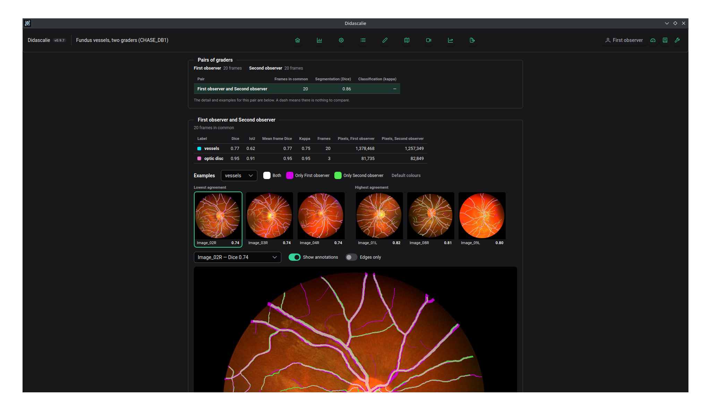

# Didascalie

Didascalie is a desktop application for annotating medical and biomedical images.
Drawing, image processing and model training all run on your own machine. Nothing
is uploaded.

A lot of medical image data cannot be sent to a cloud service. The tools that work
offline usually expect you to maintain a Python environment or to adopt a whole
analysis pipeline. Didascalie is an installer and a project file.

<!-- Screenshots live in docs/assets/screenshots/. A slide whose image is
     missing is dropped, so entries can be listed before they are captured. -->

  

    <figure>
      
      <figcaption>The editor: masks and vector shapes on the same image.</figcaption>
    </figure>
    <figure>
      
      <figcaption>Assisted labelling: a rough stroke refined by an operator.</figcaption>
    </figure>
    <figure>
      
      <figcaption>The gallery: filter sequences and track review status. Batch classify sequences</figcaption>
    </figure>
    <figure>
      <video src="assets/screenshots/inspect.webm" poster="assets/screenshots/inspect_poster.jpg"
             autoplay loop muted playsinline preload="metadata"
             aria-label="The inspector: play a sequence back with its labels."></video>
      <figcaption>The inspector: play a sequence back with its labels.</figcaption>
    </figure>
    <figure>
      
      <figcaption>Frame registration from keypoint correspondences.</figcaption>
    </figure>
    <figure>
      
      <figcaption>3D volume mode (experimental): a sequence as a volume.</figcaption>
    </figure>
    <figure>
      
      <figcaption>Multiple users can be working on a same project; inspect the intergrader assessment</figcaption>
    </figure>
  

!!! note "Status"
    This is a solo research project under active development. The core annotation
    workflow is usable day to day. Features marked **experimental** are less
    reliable.

## Where to start

-   :material-download: **[Installing](install.md)**

    Installers for Windows, macOS and Linux, plus what you need for GPU training.

-   :material-rocket-launch: **[Quickstart](quickstart.md)**

    Create a project, annotate an image, and export the result.

-   :material-book-open-variant: **[User guide](guide/projects.md)**

    Projects, annotation types, assisted labelling, review workflow.

-   :material-account-multiple: **[Several annotators](guide/multi-user.md)**

    Accounts and roles in one project file, and inter-grader agreement.

-   :material-language-python: **[Python library](python.md)**

    Read and write project files from Python, and convert to COCO or YOLO.

## What it can annotate

| Type | Notes |
| --- | --- |
| Segmentation masks | Brush, polygon, line, point, flood fill |
| Vector shapes | Polygons, lines and keypoints, convertible to and from masks |
| Classification | Multiclass and multilabel, several tasks per project |
| Keypoints | Including correspondences between frames for registration |
| Text notes | Per frame, attached to a configurable text task |

Raster and vector annotations are drawn on the same image and share one undo
history.

## Project files

A project is a single `.dida` file. It is an ordinary SQLite database that holds
the images (embedded or referenced on disk), the annotations of every account,
the label definitions, any trained model and the project settings. To back up a project or
give it to a colleague, copy that file. 

## Several annotators

One project file can hold the work of several people. Each has an account, with
or without a password, and annotates the same images independently: nobody sees
or overwrites anyone else's masks. Accounts are either editors, who annotate, or
administrators, who also manage the accounts and the project's labels.

An **inter-grader agreement** page lets administrators compare the graders pair
by pair, with Dice, IoU and kappa scores and pictures of where they differ.

A project used by one person works as it always has, with no account to pick.
See [Several annotators](guide/multi-user.md).
