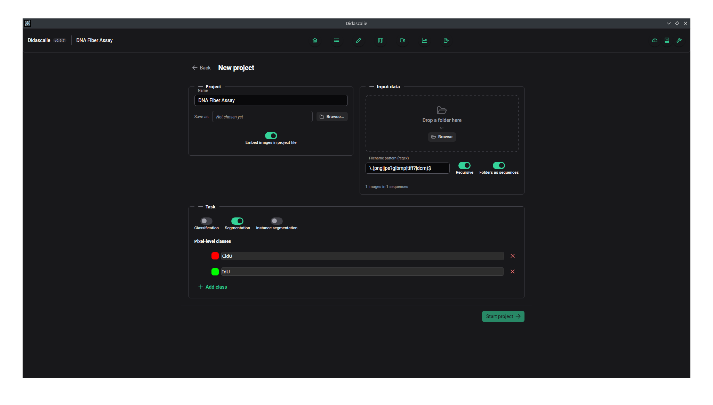

# Quickstart

This page goes through one project from start to finish: create it, annotate an
image, train a model on a few scribbles, and export the result.

## 1. Create a project

Launch Didascalie and choose **New project**. You will be asked for:

- a **name** and where to save the `.dida` file;
- an **input folder** of images;
- whether to **embed** the images or reference them on disk
  ([which to pick](guide/projects.md#embedded-or-referenced-images));
- which **annotation types** the project uses: segmentation, classification, text.



## 2. Annotate a frame

The gallery opens on the imported images. Double-click one to open the editor.

Pick the pen (++p++) and draw. Switch labels with ++ctrl+tab++. ++ctrl+z++ undoes
both mask and vector edits.

You do not have to follow the boundary precisely. Draw roughly, then apply an
operator to tidy it up, as described in
[Assisted labelling](guide/assistance.md#operators-bounded-by-your-stroke).

<!-- SCREENSHOT: the editor with a mask drawn over an image. -->

## 3. Mark it reviewed

When a frame is finished, mark it **reviewed**. Model training only uses reviewed
frames, so a frame you have not marked is ignored in the next step.

## 4. Train on a few scribbles

Open the model panel and train once you have a handful of reviewed frames. The
first run is slow because it downloads the encoder and computes features for each
image. The features are then cached, and retraining is fast.

Apply the model to unlabelled frames and correct its predictions. Details are in
[Assisted labelling](guide/assistance.md).

## 5. Get the data out

Export from the app (see [Import and export](guide/import-export.md)) or read the
project directly from Python:

```python
from didascalie import DidascalieProject

with DidascalieProject.open("dataset.dida") as project:
    for frame in project.frames():
        masks = project.masks(frame)
        ...
```

See [Python library](python.md).
